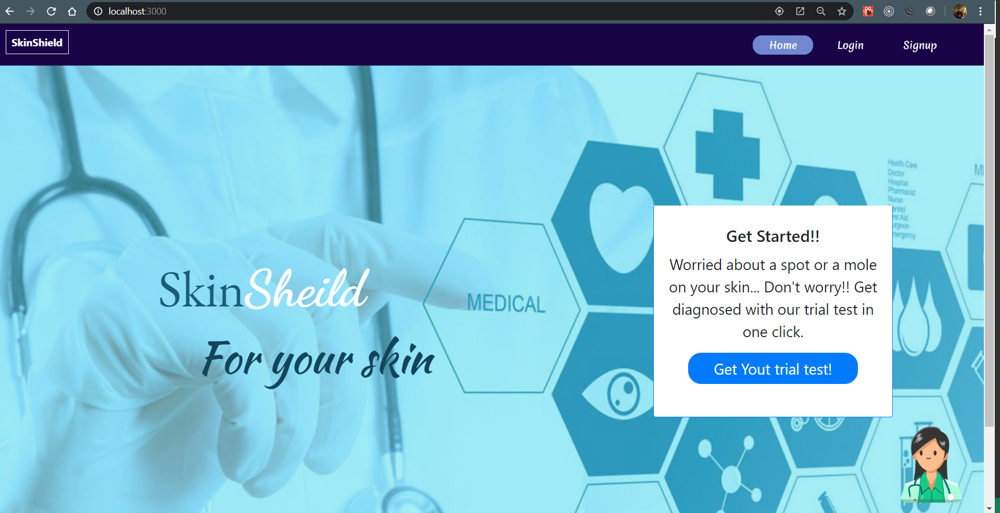
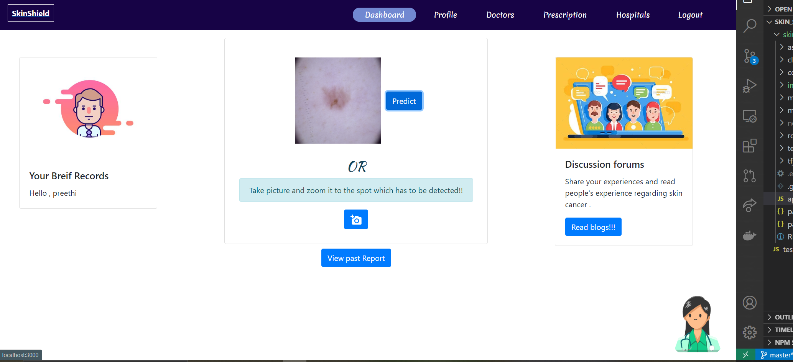
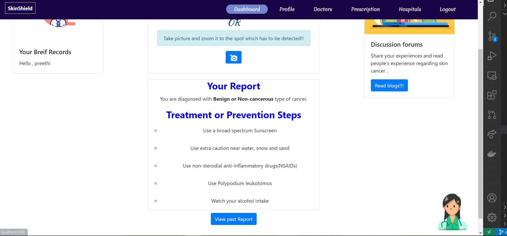
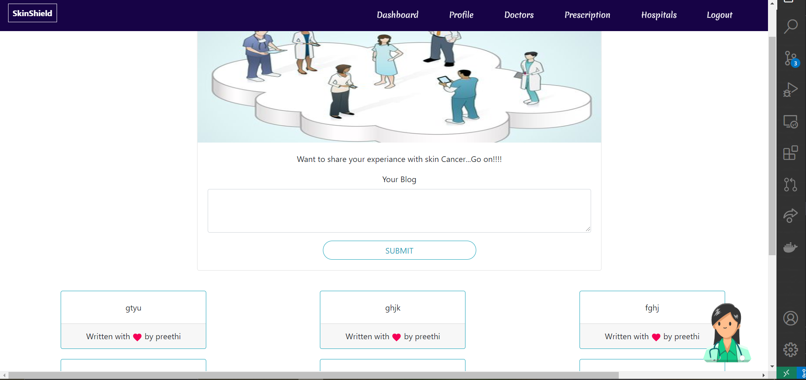
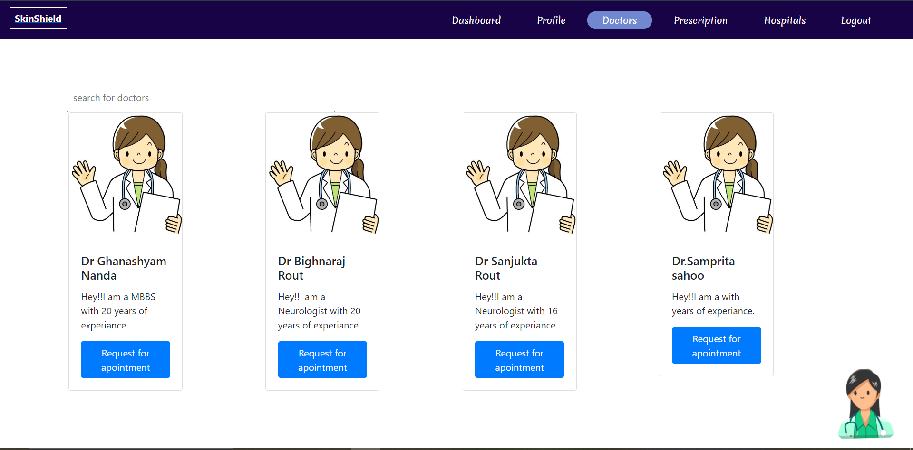

# Skin_sheild

> **Thanks to AGBI Hackathon and Judges for coming up with this hackathon and providing us a platform to exibit our skills**


```
This is under development phase
Complete practical(Production) build is still under development
```


### An all in one digital platform which bridges the gap between the patients and physicians for better care of your health during these days under monitorization from doctors. 

### [You can get all details here](https://drive.google.com/drive/folders/1QYLNXEYxfQbwQfK4mbPGXunJ73OR4RgL?usp=sharing)

## 📌 Inspiration
Skin Cancer is the most common of all cancers. The number of deaths due to skin cancer is being increased at a rapid rate. However, the survival rate for skin cancer is near 99% when detected at an "Early Stage". So it is best to detect skin cancer as early as possible. 

There are a plethora of apps that can predict skin cancer. But our App not only detects whether the user has skin cancer but also predicts the kind of cancer. 
When a person gets diagnosed with skin cancer, he/she searches for nearby hospitals and requests an appointment with a doctor. But this is a tedious procedure. 
With our SkinShield App, we have made it easy to schedule video appointments with doctors. Our app also provides locations of nearby dermatologists. If a patient has any problems, he/she can discuss this with their appointed doctors. The doctor can provide prescriptions to the patient. 

"FEAR is the worst enemy of all". A person who is diagnosed with skin cancer immediately gets anxious and worried. As a solution to this, we have included a discussion forum in our App, where users can share inspiring stories about how they fought the disease and support each other in case of any queries.
We have also integrated a virtual assistant in our App so that the user can be guided to have easy and smooth navigation throughout the App.   
After the campaign is over, with good funding, we want to improve the deep learning model with extensive research. We want to tie up with some hospitals to get in touch with the doctors and have them associated with our App.
## Idea

Skin shield is progressive web application that is installable and it gives an app-like experience on desktop and mobile that are built and directly delivered by the web. It is aimed to detect skin cancer and simplify the doctor consultation and weekly monitoring in the times of this global pandemic.

## 🎯 What it does

1.Skin shield uses deep learning algorithms to predict skin cancer.

2.Our app allows the users to get a trial test first and if they are detected with skin cancer they can create account and track their weekly progress.

3.Doctors go through the patient’s report weekly and can prescribe medicines using virtual prescriptions.

4.Patients can fix video-appointments with their doctor whenever required

5.Skin shield stores the patient’s report in the database so that the doctor can monitor them.

6.Patients can share their experience with other users or read other’s experience using Discussion forums.

**Patient**
* A patient can predict the type of cancer and some possible treatments and preventions for the detected type of cancer.

* Moreover the patient can also view his/her weekly predicted report to keep a record fo his improvement.

* Next, we have a doctors panel where patient can go through doctors profile and request for appointment according to his requirements.

* Upon confirmation from doctor, we have one prescription panel where patient can view his doctors who will monitor them and go to the prescription page and tell the doctors about his problem and get prescribed by them.

* In the prescription panel we are also giving feature to appoint for video call. Patient can request for a video call and can view his scheduled event details once the doctor scheduled it.

* Next we have discussion forums where all the patients can discuss about their experiences with skin-cancer so that no one panics if he/she is diagonised.

* Patient can also view its nearest hospital based on his location and get its details like ambulance number for emergency use.

**Doctor**
* Upon login, doctor will get his dashboard where he get the patients whom he was monitoring. He can view each patient reports on weekly basis and monitor him.

* Next, prescription panel is available where he can prescribe his patient upon monitoring his data on daily basis.

* Doctor can schedule his video appointment through Meet using Google calendar when requested by the patient.

* Coming to rural uneducated people, we have developed a chatbot which can guide them to use the app. For minor consultation, chatbot can also provide you with the medicines details and the doctors details for easy use.


## Screenshots








## How we built it 🏁 Technology Stack

**Frontend**
* [React](https://reactjs.org/)
* [Redux](https://redux.js.org/)
* [React-Bootstrap](https://react-bootstrap.github.io/)


**Backend**
* [Nodejs](https://nodejs.org/en/)
* [mongoDB](https://www.mongodb.com/)
* [nodemailer](https://nodemailer.com/about/)
* [express](https://expressjs.com/)
* [tensorflowjs- model integration](https://www.tensorflow.org/js/models)

**Other**

* [Mapquest](https://www.mapquest.com/)
* [Here API](https://developer.here.com/)
* [Google-Map-API](https://developers.google.com/maps/documentation)
* [Stripe](https://stripe.com/in)
* [IBMwatson-Assistant](https://www.ibm.com/cloud/watson-assistant/)
* [PWA](https://web.dev/progressive-web-apps/)
* [Helmet](https://helmetjs.github.io/)

## Challenges we ran into

* Overfitting of the deep learning model because of no proper dataset

* Configuring the dependencies while integrating the deep learning model.

* Obtaining a well balanced dataset for skin cancer classification.

* We need to make a robust architecture of database for such a big platform and organising events for both patient and doctor via virtual prescription.

* We need to search for many packages capable of supporting the application in maintaining the application.

* For tracking user's location and searching nearest hospitals  we need to search for appropriate packages and availability for APKs.

* Planning for integrating an online payment system for ordering needs and delivering commodities.

* Gathering data about local facilities for building the necessary modules.

* We need to think of a flexible and user friendly UI for smooth interaction between doctor and patient.


## Prerequisties

**For backend, ML model and web app**
* node and npm installed
* Ensure Python 2.x is installed
* Ensure your system has only 2.x version not more than one versions
* Ensure node-gyp is installed(npm install -g node-gyp)
* Ensuire windows buil tool is installed(npm install -g --production windows-build-tools)

## Installation & Setup 

A step by step series of examples that tell you how to get a development env running

**To start the server**
Go to root of the project, run

```
npm install
```

```
npm start
```

Server will be running on localhost

**To start the web app**
Go to root of the project, run

```
cd client
```

```
npm install
```

```
npm start
```

A react app will be running on your browser.


**set up env file**

In the root directory

```
MONGODB_URI = ''
api_key = ''
MODEL_PATH = 'file://E:/WORKSPACE/skin_shield/skinShield'(example)
WEB_PUSH_CONTACT = ''
PUBLIC_VAPID_KEY = ''
PRIVATE_VAPID_KEY = ''

```

Inside the client

```
REACT_APP_PUBLIC_VAPID_KEY= ''
REACT_APP_LINK = 'http://localhost:3001'

```

## Team Members
* Ritvik Nimagada           
* Preethi Chandra
* Saiprava Raut
* Shubhadarshie Nanda

 **Made with ❤ Team sudoHackers**
